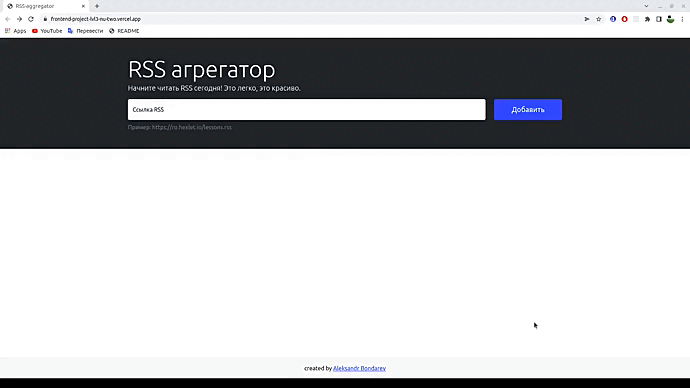

# [RSS агрегатор](https://frontend-project-lvl3-nu-two.vercel.app/)

### Hexlet tests and linter status:
[](https://github.com/Aleksandr-Bondarev/frontend-project-lvl3/actions)
[](https://github.com/Aleksandr-Bondarev/frontend-project-lvl3/actions/workflows/NodeCI.yml)
[](https://codeclimate.com/github/Aleksandr-Bondarev/frontend-project-lvl3/maintainability)

## Описание
[RSS агрегатор](https://frontend-project-lvl3-nu-two.vercel.app/) — сервис для агрегации RSS-потоков, с помощью которых удобно читать разнообразные источники, например, блоги. Он позволяет добавлять неограниченное количество RSS-лент, сам их обновляет и добавляет новые записи в общий поток.

## Превью


## Установка

```sh
make install
```

## Запуск локального сервера

```sh
make start
```
